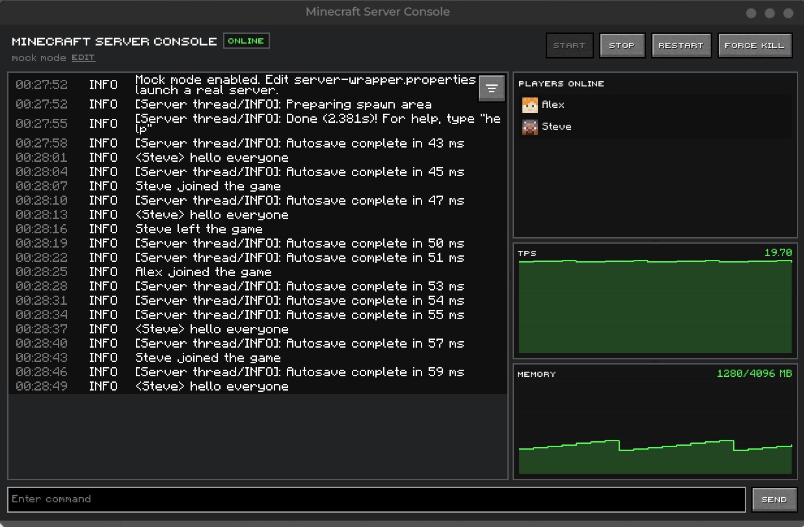

# Minecraft Server Console Wrapper

`server-gui` is a desktop wrapper for an existing Minecraft server. Drop it into a normal server folder, launch it once, and it will detect common server jars, build the default launch command, and write `server-wrapper.properties` for you.



## Installation

1. Copy `server-gui-0.1.0.jar` from `target/` into your server folder.
2. Run it once:

```bash
java -jar server-gui-0.1.0.jar
```

On first launch, the wrapper will:

- detect common server jars
- write `server-wrapper.properties`
- create or overwrite `start.sh`
- create or overwrite `start.bat`

After that, you can launch it with the generated script:

```bash
./start.sh
```

Generated `start.sh`:

```bash
#!/bin/bash
cd "$(dirname "$0")"
JAR="$(ls server-gui*.jar 2>/dev/null | head -n 1)"
if [ -z "$JAR" ]; then
  echo "server-gui jar not found."
  exit 1
fi
nohup java -jar "$JAR" &>/dev/null &
```

## What It Does

- wraps an existing Paper, Purpur, Spigot, or similarly named server jar
- auto-detects common server jars on first launch
- writes `server-wrapper.properties` automatically
- creates launcher scripts automatically on first launch
- launches the server with `nogui`
- provides a Minecraft-styled desktop console wrapper
- shows live logs, filters, command input, player list, TPS, and memory
- includes mock mode when no supported server jar is found
- lets you edit wrapper settings from the app

## Usage

On first launch, the wrapper looks for a server jar in the same folder. If it finds something like `paper-...jar`, `purpur-...jar`, `spigot-...jar`, or `server.jar`, it fills in `server.command` automatically and disables mock mode.

If no supported jar is found, the wrapper stays in mock mode so you can test the UI safely.

After the first run, you normally just launch the wrapper again with `./start.sh`.

On Linux, the app also writes a desktop entry after launch, so you may be able to start it from your application menu afterward. The script is still the simplest documented setup.

## File Structure

- `target/server-gui-0.1.0.jar`: packaged wrapper jar
- `server-wrapper.properties`: generated wrapper config in the server folder
- `start.sh`: generated Unix launcher script
- `start.bat`: generated Windows launcher script

## Configuration

Typical generated config:

```properties
app.title=Minecraft Server Console
mock.mode=false
server.command=java -Xms3G -Xmx6G -jar "paper-1.21.10-130.jar" nogui
working.directory=.
poll.players.seconds=30
poll.tps.seconds=30
poll.heap.seconds=20
```

Important notes:

- keep `nogui` in `server.command`
- heap changes require a server restart to take effect
- player/TPS polling works best on Paper-compatible servers
- memory uses `jcmd` against the launched Java child process

## Editing

Most users should edit settings from the app’s settings dialog instead of editing the config file directly.

Direct file editing is still fine if you want to:

- rename the window
- change polling intervals
- adjust `-Xms` and `-Xmx`
- point the wrapper at a different launch command

## Contributing

- keep changes focused
- prefer small, reviewable commits
- preserve user files and existing server folders
- test with both mock mode and a real detected server jar when possible

## Committing

- do not commit generated server-folder files unless intentionally updating an example
- commit source, resources, and README changes only
- keep packaged jars out of normal source commits unless you are intentionally publishing a build
